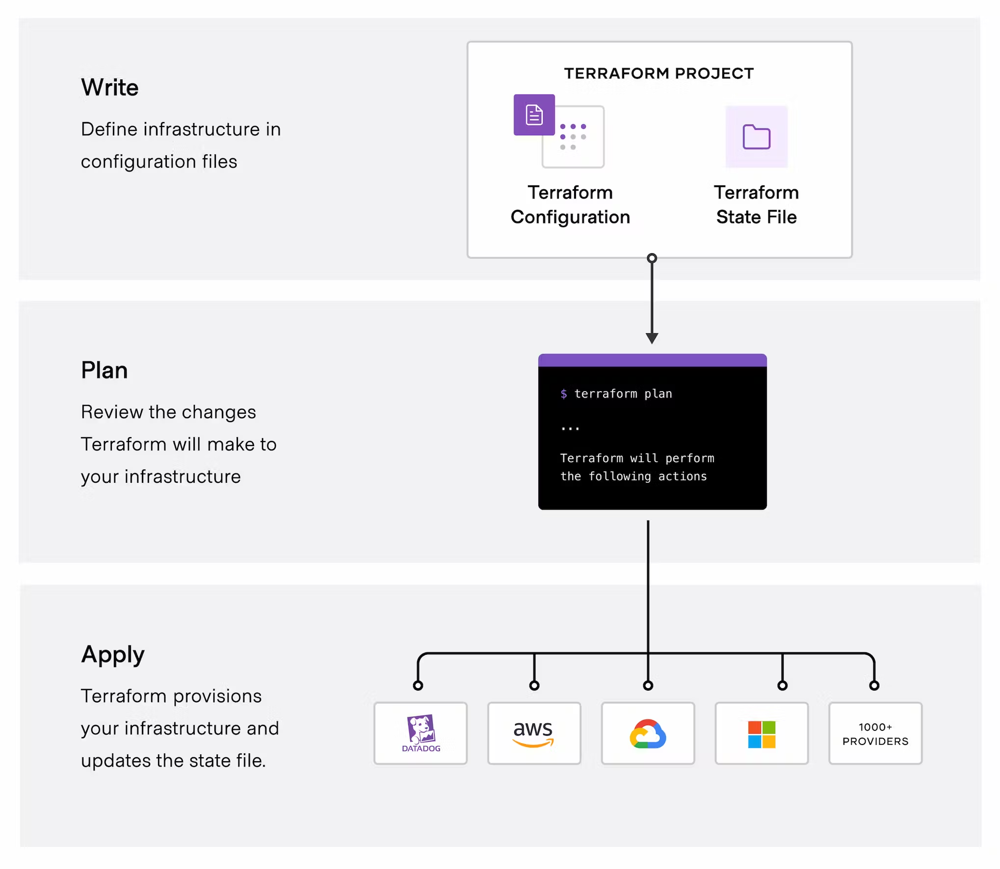

# Terraform Playroom/Einarbeitung
This is a personal playroom/Einarbeitungsraum for Jon to get to grips with Terraform.
Within this will be helpful notes and explanations of Terraform quirks and syntax.

## What is Terraform?
Terraform is an infrastructure as code tool that lets you build, change, and version cloud and on-prem resources safely and efficiently.

Terraform is what is known as a declaritive language.
> ... a style of building the structure and elements of computer programs—that expresses the logic of a computation without describing its control flow.

In laymens this means that we do not need to tell Terraform to build a connection to the cloud provider's API and follow it up with specific instructions of what we want to setup.

We **declare** to Terraform what we want to have, give it all the settings and configuration it needs, and it goes off and builds that what we want.
> Instead of a set of instructions, it's more of a wish list or "order sheet".

This also means that when there are already services running in the cloud that we want to update, Terraform does not nuke everything and start from 0, but rather performs rolling changes. If just a name label of an Ec2 instance has changed, only that change will be performed.

## About the Terraform language
The main purpose of the Terraform language is declaring resources, which represent infrastructure objects. All other language features exist only to make the definition of resources more flexible and convenient.
> https://developer.hashicorp.com/terraform/language
